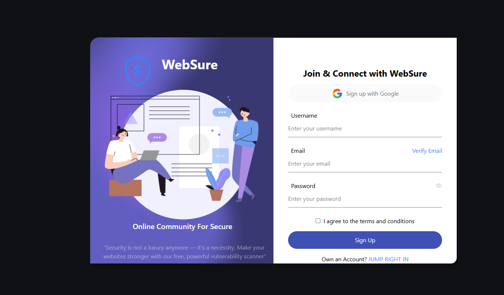
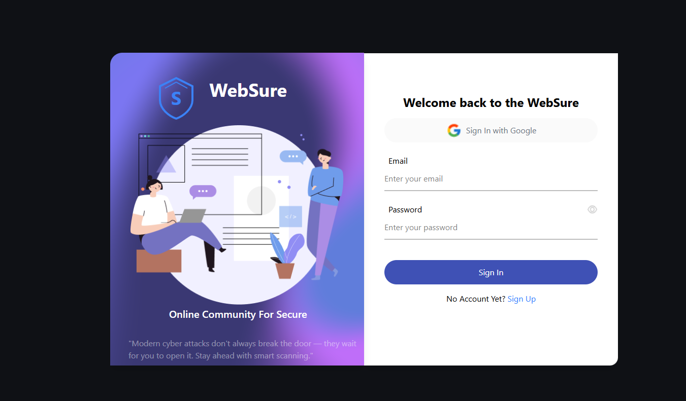
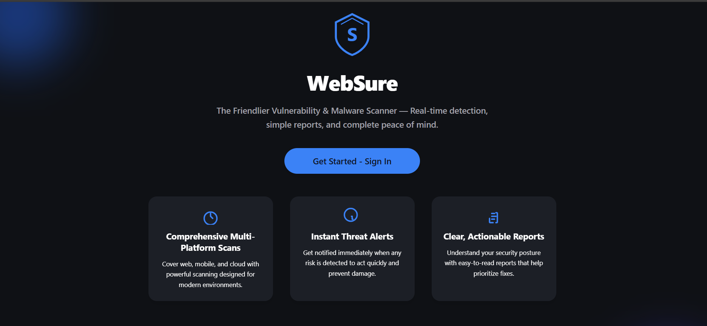
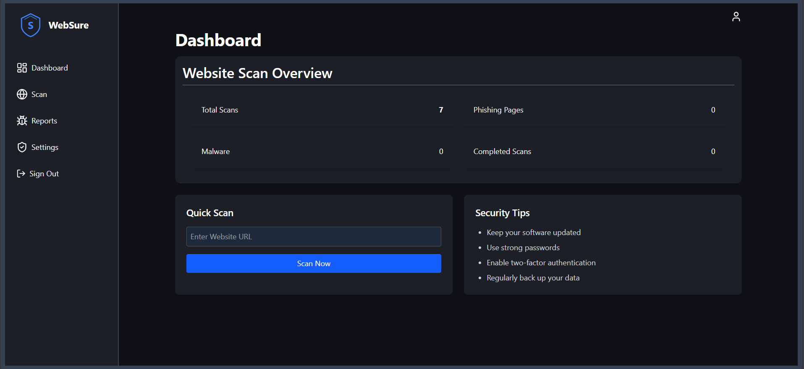
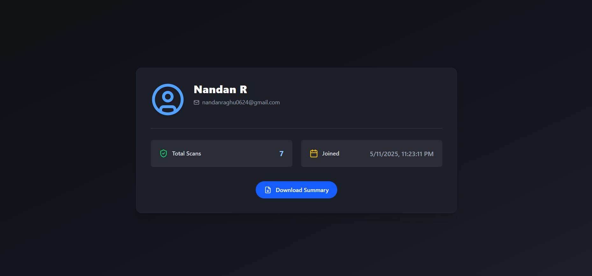
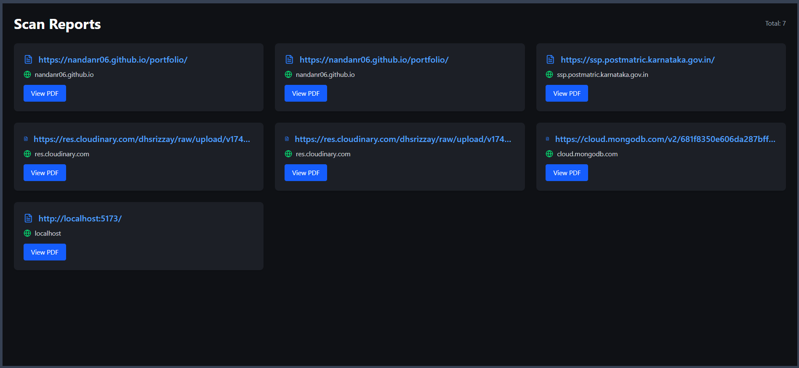

#  CyberSecure-web – Web Vulnerability & Malware Scanner

CyberSecure-web is a powerful and user-friendly MERN stack application designed to scan websites for vulnerabilities, malware, phishing links, DNS issues, and more. It aims to provide free, open-source web security analysis in a clean and intuitive dashboard.  

## 🚀 Features

-  Website vulnerability scanner
-  Malware and phishing URL detection
- CMS detection (WordPress, Joomla, etc.)
-  HTTP security headers check
-  Port scanning
- Custom security recommendations
-  PDF Report generation
-  Authenticated dashboard (JWT)
-  Full user scan history

---

## 🖼️ UI Screenshots

> 💡 All UI is developed with **React.js**, styled using **Tailwind CSS**, and the backend is powered by **Node.js** & **Express.js**, with **MongoDB** as the database.

| Sign Up | Sign In | Home |
|--------------|-----------|-----------|
|  |  |  |

| Dashboard | User Profile  | Scan Result |
|----------------|------------|----------|
|  |  |  |

| Reports | PDF Report|
|---------|------------|
|  |  | 


## 🎯 Project Goals

- Create a lightweight and accessible web vulnerability scanner for educational and awareness purposes.
- Promote cybersecurity awareness among students, developers, and startups.
- Provide downloadable reports to share scan results or store them securely.

---

## 🧰 Tech Stack

- **Frontend:** React.js, Tailwind CSS, Axios, Toastify  
- **Backend:** Node.js, Express.js  
- **Database:** MongoDB (with Mongoose)  
- **Authentication:** JWT-based login system  


## 🛡️ License


This project is licensed under the **MIT License**.  
You are free to use, modify, and distribute this software with proper attribution.

➡️ See the [LICENSE](./LICENSE) file for full license text.  
📜 Or read it here: [MIT License on opensource.org](https://opensource.org/licenses/MIT)


## 📦 Installation

### 1. Clone the Repository

```bash
git clone https://github.com/yourusername/CyberSecure-web.git
cd CyberSecure-web

cd backend
npm install
Add your .env file with:
#MONGO_URI=
#JWT_SECRET=
#PORT=
npm run dev

cd frontend
npm install
npm run dev

